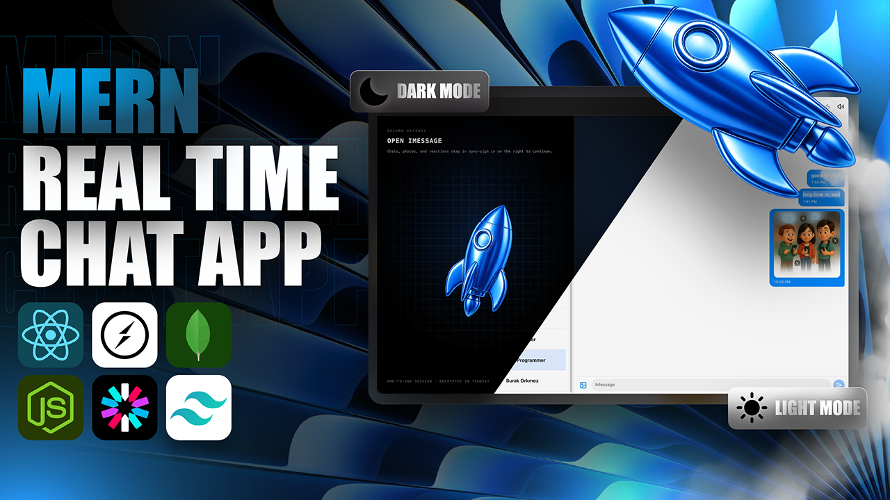

# 💬 BlinkTalk — Full Stack Real-Time Chat Application

<p align="center">
  
</p>

<p align="center">
  <b>Modern • Fast • Secure • Real-Time Messaging Platform</b>
</p>

<p align="center">
  
  
  
  
  
  
</p>

---

## 📸 Preview

<p align="center">

</p>

---

# ✨ Features

### 💬 Messaging

- ⚡ Real-Time Messaging with Socket.io
- 🟢 Online User Status
- 📩 Instant Message Delivery
- 📷 Image Sharing
- 🎥 Video Sharing
- 📂 File Upload Support

---

### 🔐 Authentication

- Clerk Authentication
- Secure Session Management
- Protected Routes
- Webhook Integration
- User Synchronization

---

### 🎨 UI / UX

- 🌙 Dark Mode
- ☀️ Light Mode
- 🎨 11 Beautiful Themes
- 🖼️ 13 Custom Wallpapers
- 📱 Fully Responsive Design
- 💻 Desktop Friendly
- ⚡ Smooth Animations

---

### ⚙️ Backend

- REST APIs
- Express Middleware
- MongoDB Integration
- ImageKit Media Storage
- Socket.io Server
- Cron Jobs
- Production Ready Architecture

---

# 🛠 Tech Stack

## Frontend

- React
- Vite
- Tailwind CSS
- Hero UI
- Zustand
- Axios
- Socket.io Client

## Backend

- Node.js
- Express.js
- MongoDB Atlas
- Mongoose
- Socket.io
- Clerk
- ImageKit

## Deployment

- Render
- MongoDB Atlas

---

# 📂 Project Structure

```text
BlinkTalk/
│
├── frontend/
│   ├── public/
│   ├── src/
│   └── package.json
│
├── backend/
│   ├── src/
│   │   ├── controllers/
│   │   ├── routes/
│   │   ├── models/
│   │   ├── middleware/
│   │   ├── lib/
│   │   ├── webhooks/
│   │   └── seeds/
│   │
│   └── package.json
│
└── README.md
```

---

# 🚀 Getting Started

## 1️⃣ Clone Repository

```bash
git clone https://github.com/your-username/BlinkTalk.git

cd BlinkTalk
```

---

## 2️⃣ Install Dependencies

### Backend

```bash
cd backend
npm install
```

### Frontend

```bash
cd frontend
npm install
```

---

## 3️⃣ Environment Variables

### Backend

Create a `.env` file inside **backend**

```env
PORT=3000

NODE_ENV=development

MONGO_URI=your_mongodb_connection_string

CLERK_PUBLISHABLE_KEY=your_publishable_key
CLERK_SECRET_KEY=your_secret_key
CLERK_WEBHOOK_SIGNING_SECRET=your_webhook_secret

IMAGEKIT_PRIVATE_KEY=your_imagekit_private_key

FRONTEND_URL=http://localhost:5173
```

---

### Frontend

Create a `.env` file inside **frontend**

```env
VITE_CLERK_PUBLISHABLE_KEY=your_publishable_key
```

---

## 4️⃣ Seed Database

```bash
cd backend

npm run db:seed
```

---

## 5️⃣ Run Backend

```bash
npm run dev
```

---

## 6️⃣ Run Frontend

```bash
npm run dev
```

---

# 📦 Build for Production

### Frontend

```bash
npm run build
```

### Backend

```bash
npm run build
```

---

# 🌐 Deployment

This project is deployed using

- Render
- MongoDB Atlas
- Clerk
- ImageKit

---

# 📱 Features Overview

✅ Authentication

✅ Real-Time Chat

✅ Online Users

✅ Image Sharing

✅ Video Sharing

✅ Responsive Design

✅ Light/Dark Theme

✅ Wallpaper Customization

✅ Theme Switching

✅ Media Upload

✅ Socket.io Integration

✅ MongoDB Atlas

✅ Clerk Authentication

---

# 📈 Future Improvements

- ✅ Message Reactions
- ✅ Voice Messages
- ✅ Video Calling
- ✅ Typing Indicator
- ✅ Read Receipts
- ✅ Push Notifications
- ✅ Group Chats
- ✅ Message Search
- ✅ Emoji Picker

---

# 🤝 Contributing

Contributions are welcome!

1. Fork the repository

2. Create your feature branch

```bash
git checkout -b feature/NewFeature
```

3. Commit your changes

```bash
git commit -m "Add New Feature"
```

4. Push

```bash
git push origin feature/NewFeature
```

5. Open a Pull Request

---

# 📄 License

This project is licensed under the MIT License.

---

# 👨‍💻 Author

**Pragati Pandey**

GitHub: https://github.com/your-github-username

LinkedIn: https://linkedin.com/in/your-linkedin

---

<p align="center">

⭐ If you like this project, don't forget to star the repository!

Made with ❤️ using React, Node.js and MongoDB.

</p>
